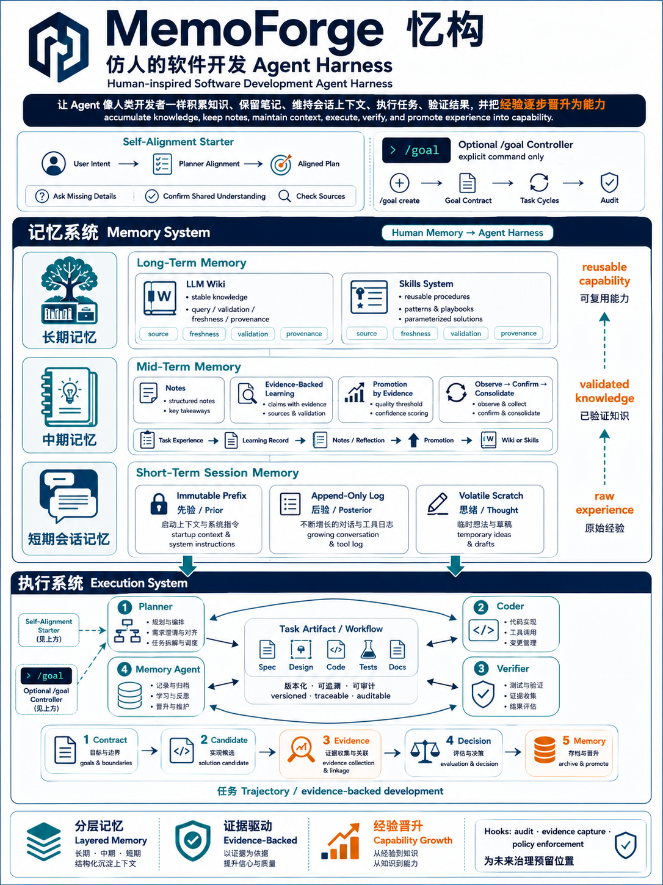

# MemoForge / 忆构

Public GitHub repository: <https://github.com/hu-jy23/memoforge>

**A memory-centered agent harness for long-horizon software development.**

MemoForge is a public release of our course project harness. It packages a multi-agent software-development workflow with self-alignment, deterministic context injection, project memory, evidence-backed task artifacts, and optional long-horizon goal control.



## Why This Exists

Modern coding agents are strong on short, mainstream programming tasks, but they still struggle with long-running engineering work where context, validation, domain rules, and accumulated experience matter.

MemoForge treats software development as a harnessed process:

```text
User intent
  -> Planner self-alignment
  -> task contract
  -> candidate implementation
  -> verification evidence
  -> promotion decision
  -> project memory update
```

The core design is inspired by human memory and workflow:

- **Long-term memory**: wiki and reusable skills.
- **Mid-term memory**: notes, reflections, and evidence-backed learning records.
- **Short-term memory**: immutable prefix, append-only session log, and volatile scratch.
- **Execution**: Planner, Coder, Verifier, and Memory Agent.
- **Governance**: task artifacts, evidence, promotion gates, reserved hooks, and tool-call repair positions.

## Repository Status

This repository is the public-facing release package synced from the research workspace.

It is intended to be uploaded directly to GitHub. Generated caches and runtime workspaces are ignored; the included `examples/` directory keeps one audited task cycle for demonstration.

The bundled `agents/memory/store/` contains a sample domain memory from the MindFormers pilot used during development. Treat it as a worked example of the memory layout. For a new domain, clear or replace the wiki, notes, and learning files after reviewing the schemas.

## Quick Start

Prerequisites:

- Python 3.10+
- Claude Code CLI if you want to run the prompt profiles directly.
- `beautifulsoup4` for the starter wiki builder.

Install Python dependency:

```bash
pip install -r requirements.txt
```

Validate the released harness:

```bash
python3 tools/validate_harness.py
```

Compile deterministic context for a profile:

```bash
python3 tools/compile_project_context.py --profile planner --output workspace/prefix/planner.md
python3 tools/compile_project_context.py --profile coder --output workspace/prefix/coder.md
python3 tools/compile_project_context.py --profile verifier --output workspace/prefix/verifier.md
python3 tools/compile_project_context.py --profile memory --output workspace/prefix/memory.md
```

Run the task-cycle smoke test:

```bash
python3 tools/run_task_cycle_smoke.py
```

## Public Component Map

Every major component is backed by an explicit Markdown document, context prompt, manifest, or validator.

| Component | Purpose | Public location |
|---|---|---|
| Planner prompt | User-facing orchestrator; performs self-alignment, routing, and task-cycle ownership | `CLAUDE.md` |
| Coder prompt | Candidate implementation owner | `agents/coder/CLAUDE.md` |
| Verifier prompt | Validation, evidence, and promotion-decision owner | `agents/verifier/CLAUDE.md` |
| Memory Agent prompt | Sole writer to persistent project memory | `agents/memory/CLAUDE.md` |
| Project status layer | Root architecture commitments and routing rules | `PROJECT_STATUS.md` |
| Alignment starter | Planner's default starter protocol for user-intent alignment | `docs/alignment_starter_protocol.md` |
| Goal harness | Optional `/goal` command design for long-horizon control | `docs/goal_harness.md` |
| Session context architecture | Immutable prefix, append-only log, volatile scratch model | `docs/session_context_architecture.md` |
| Task artifact protocol | Contract, candidate, evidence, decision, memory handoff | `docs/task_artifact_protocol.md` |
| Runtime extension points | Reserved hooks, tool-call repair, lightweight subagent positions | `docs/runtime_extension_points.md` |
| Memory system design | Human-memory-inspired wiki, notes, learning, skills layout | `docs/memory_system_design.md` |
| Prefix manifest | Deterministic context input list for each agent profile | `context/prefix_manifest.json` |
| Prefix compiler | Assembles immutable-prefix context with source hashes | `tools/compile_project_context.py` |
| Runtime manifest | Machine-checkable extension registry | `runtime/extension_manifest.json` |
| Goal state directory | Persistent state for explicit `/goal` sessions | `goals/` |
| Workspace contract | Ephemeral task-cycle workspace convention | `workspace/README.md` |
| Wiki store | Long-term domain and project knowledge | `agents/memory/store/wiki/` |
| Notes store | Mid-term observations awaiting consolidation | `agents/memory/store/notes/` |
| Learning store | Evidence-backed per-task learning records | `agents/memory/store/learning/` |
| Skills store | Validated procedural memory and skill packages | `agents/memory/store/skills/` |
| Starter wiki builder | Builds initial wiki pages from source docs | `starter/` |
| Example task cycle | Public demo of contract, candidate, evidence, decision | `examples/custom-callback-norm-lr-01/` |
| Release report | Paper-style project report draft | `REPORT.md` |

## Architecture

### 1. Planner Self-Alignment

Planner always begins by aligning the user request before routing work. For simple tasks this can be compact. For complex tasks it expands into a MultiAlignment process:

- ask missing details,
- confirm shared understanding,
- assemble required sources,
- produce or update a plan,
- request user double check when needed.

The optional `/goal` controller is separate. It only starts when the user explicitly invokes `/goal ...`.

### 2. Four Main Agents

```text
Planner
  -> Coder
  -> Verifier
  -> Memory Agent
```

The four main agents stay stable. Lightweight subagents may be used inside those roles, but they do not become new top-level roles.

### 3. Project Memory

```text
agents/memory/store/
  wiki/      stable long-term knowledge
  notes/     mid-term observations
  learning/  evidence-backed task learning
  skills/    validated reusable procedures
```

Planner does not directly read or write the memory store. Memory access goes through the Memory Agent boundary.

### 4. Evidence-Backed Task Cycle

```text
task_contract.md
  -> candidates.jsonl
  -> evidence/
  -> verify_result.json
  -> promotion_decision.md
  -> learning / notes / wiki / skills
```

This keeps "agent completed a task" separate from "we have evidence that the result is correct and worth promoting."

## Validation

Run all structural checks:

```bash
python3 tools/validate_harness.py
```

Checks include:

- prefix manifest JSON,
- runtime manifest JSON,
- deterministic prefix compilation,
- Python syntax compilation,
- wiki schema validation,
- skills schema validation,
- runtime extension validation,
- goal/alignment integration validation,
- isolated task-cycle smoke test.

Workspace validation is separate because `workspace/` is intentionally ephemeral:

```bash
python3 tools/validate_task_artifacts.py
```

## Directory Layout

```text
.
├── CLAUDE.md
├── PROJECT_STATUS.md
├── REPORT.md
├── agents/
│   ├── coder/CLAUDE.md
│   ├── verifier/CLAUDE.md
│   └── memory/
│       ├── CLAUDE.md
│       └── store/
├── assets/poster/memoforge-poster.png
├── context/prefix_manifest.json
├── docs/
├── examples/custom-callback-norm-lr-01/
├── goals/
├── runtime/
├── starter/
├── tools/
└── workspace/
```

## GitHub Upload Checklist

```bash
cd harness-release
python3 tools/validate_harness.py
git init
git add .
git commit -m "Release MemoForge harness"
git branch -M main
git remote add origin <your-repo-url>
git push -u origin main
```

## License

This release uses the MIT License. Change `LICENSE` before publishing if your course or lab requires a different license.
